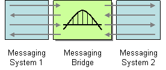

# Overview Architecture


# grafana-webhook
grafana-webhook provides an easy way to write go http handlers for webhook channels

## Usage example
Handle Grafana request and send a message by a service:

```go

...

// sending messages server
func main() {
	e := echo.New()
	bridgeService := services.NewMessageBridgeService()
	e.POST("/process", func(c echo.Context) error {
		messageContract := new(contracts.BridgeMessageContract)
		if err := c.Bind(messageContract); err != nil {
			return c.String(http.StatusBadRequest, err.Error())
		}

		err := bridgeService.Process(messageContract)
		if err != nil {
			return c.String(http.StatusBadRequest, err.Error())
		}

		return c.JSON(http.StatusAccepted, "")
	})

	go e.Logger.Fatal(e.Start(":1323"))
}

...

```

Above listener can be used to fill the url input in [Grafana Webhook notification channel](http://docs.grafana.org/alerting/notifications/#webhook).